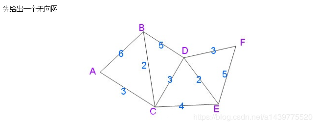
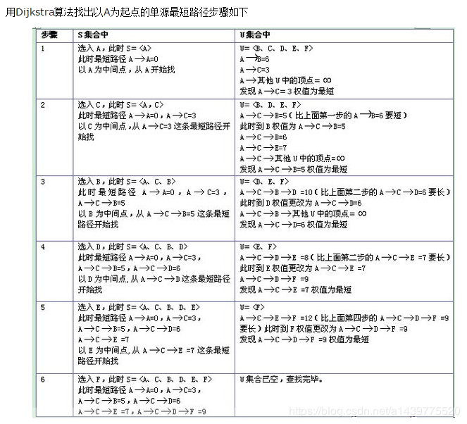

## Test1 动物之王
### 问题
选动物老大，n个小动物，编号1-n,代表武力值，值越小，武力值越高，每个小动物都有一票投票权，如果有崇拜的对象（也就是`>0`），可以投给自己或者自己崇拜的动物跟票；如果没有崇拜的对象（也就是0），则只能投票给自己。只能崇拜武力值比自己厉害的动物。

输入：第一行：n个动物参与，4

后面n行:第几个小动物的崇拜对象`0 1 1 1`

输出：每个小动物的最多的投票。`4 1 1 1`

### 思路
* 递归法

分为2种情况，（1）没有崇拜的对象，自己投自己，可以直接结束递归；（2）有崇拜的对象，除了可能投自己外，还可能和崇拜的对象投一样的票

所以第（2）种情况下，递归结束的条件是崇拜的对象没有崇拜的对象，每次递归都（可能）要给该动物投票

## Test2 最长时间
### 问题
n个城市n个人，每个城市一个人，选择一个城市x，所有人去那聚会，聚合结束所有人返回各自城市。

有m条单向路径，保证每个人可以到达城市x，一个人所消耗时间为往返时间和，每个人选择自己的最短路径，问最长的时间是多少。

输入：第一行：n个城市，m个单向路数量，x是参加聚会的城市 4 8 2

后面m行：单向路起点 终点 花费的时间

```
1 2 4
1 3 2
1 4 7
2 1 1
2 3 5
3 1 2
3 4 4
4 2 3
```

输出：花费时间最多的是多少 

10（4到2 的时间为3；2回到4的时间是7：所以答案是10）

### 思路
* **递归法**

（1）除了目的地城市x，为每个城市遍历，找到所有可能的路径长度，找出最小的保存

需要注意的是，可能会因为城市路径内部会形成环形，造成无限迭代，可以通过递归的层数是否超过了2倍总城市数目m来判断是否可以直接介绍掉递归

（2）从所有保存的长度中选择最大的长度

* **Dijkstra算法**

1. 计算每个起点到其他点的最短路径

从中可以得到起点到终点的最短路径

Dijstra算法举例





2. 计算终点到其他点的最短路径

3. 来回相加，找出最大的

*Dijkstra算法流程补充*

(1) 确定起始地址Z

(2) 初始化该起始地址到其他地址的长度数组

(3) 从长度数组中选择一个最短的MIN，目的地址为X

(4) 以MIN为基础，从X出发到其他目的地Y的长度LEN，MIN + LIN是否小于对应Z到Y的长度

(5) 重复(3) - (4) , 且已经使用过的不再使用